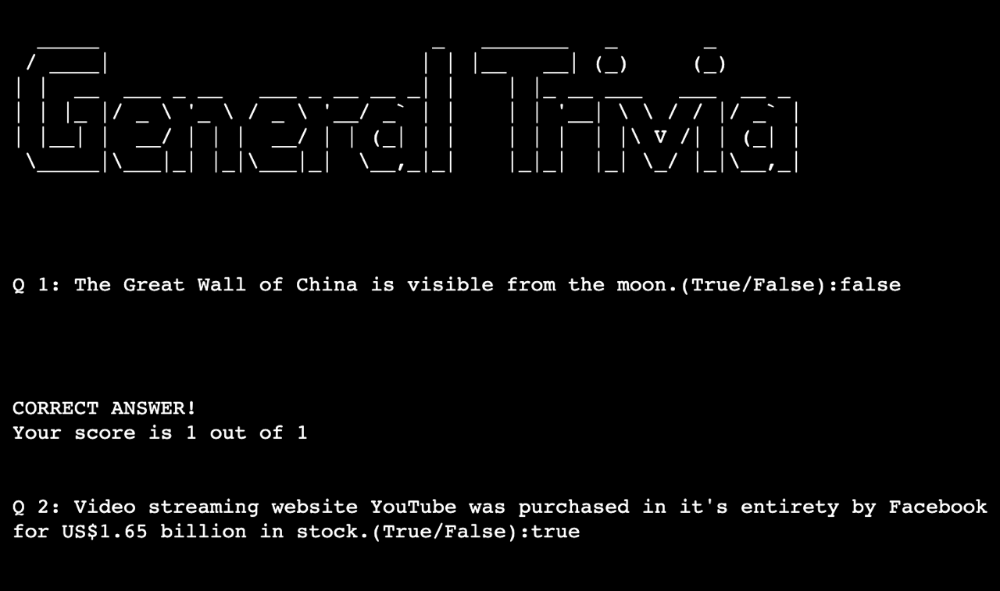
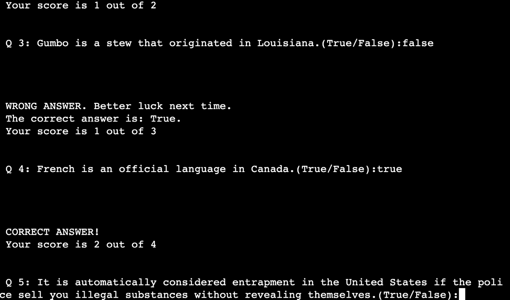
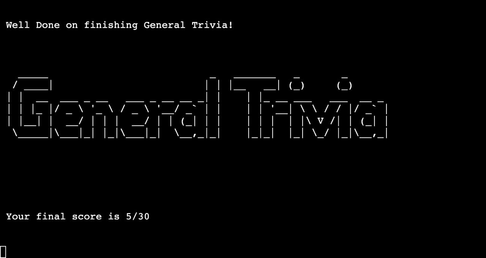
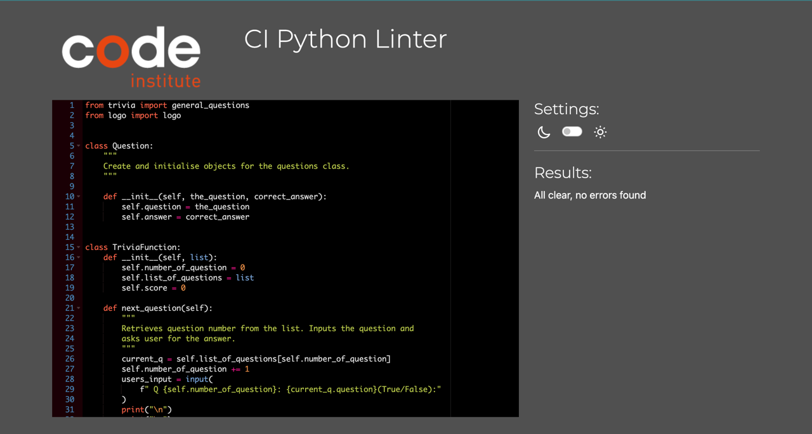

Welcome to General Trivia!

This is a General knowledge trivia quiz
created using Objected orientated programming and python.

There are 30 questions and the user is to input either "True" or "False"

[Deployed Project](https://general-trivia-222519faad7b.herokuapp.com/)
[Github Repo](https://github.com/Omar-Alme/general-trivia)

## Features

The user inputs true or false for answer. .lower() feature is used so it doesn't matter if user inputs capital letters or lowercase. Prone to error.

The question number goes up by 1. The correct answer is shown to user when they input the incorrect answer. Their current score is also shown to them after every question.

Final score is shown to the user at the end of the trivia.

## Data model

The deployment terminal is set to 80 columns by 24 rows. That means that each line of text needs to be 80 characters or less otherwise it will be wrapped onto a second line.

## Technologies Used

 - [ASCII art generator](https://patorjk.com/software/taag/#p=testall&f=Graceful&t=Sport%20Trivia%20) was used to transform the text to ascii art for the terminal.
 - [Open Trivia Database](https://opentdb.com/) a free to use, user contributed trivia question database used to generate the API documentation for the quiz.
 - [Python](https://www.python.org/) is the programming language used.
 - [VScode](https://code.visualstudio.com/) Integrated development environement and rich text editor.
 - [Heroku](https://www.heroku.com/) is the cloud application platform used to create and host apps.
 - [Github](https://github.com/Omar-Alme/general-trivia) for version control.
 - [PEP8CI](https://pep8ci.herokuapp.com/) was used to validate Python code.
 - [Node.js](https://nodejs.org/en) 
 
 
## Testing
### Bugs

#### Solved bugs
 - Diabled pylint so the application can run. And other files can be imported.

All the bugs were fixed.

### Validator Testing

No errors were found when went through the python validator.

## Deployment
 The program was deployed in Heroku.

  - Steps for deployment:
     1. Log in to Heroku and go to dashboard
     2. Click on "New" button and create a new app
     3. Name the app and click create app.
     4. Go to the app's settings, click "Reveal Config Vars.
     5. Create a Configuration variable "PORT" with value "8000".
     6. Scroll down to "Buildpacks" and add Python first then Node.js. The order of the dependencies is important!
     7. Navigate to "Deploy".
     8. Choose Github as the deplyment method and connect your Heroku to Github, then select the repository you wish to deply.
     9. Enable Automatic Deploy.
     10. Manually Deploy the Project .

## Credits
  - [How to build a multiple Choice quiz in Python](https://www.youtube.com/watch?v=SgQhwtIoQ7o&list=PLLAZ4kZ9dFpMMs5lskzBApYXn0bl7emsW&index=33) similar code used but changed to be original.
  - [Python object oriented programming for beginners](https://www.youtube.com/watch?v=JeznW_7DlB0) tutorial by Tech with Tim helped understand concept of OOP.
  - [W3school](https://www.w3schools.com/python/gloss_python_class_init.asp) documentation for the initialisation function.
  - [TypeError](https://www.learndatasci.com/solutions/python-typeerror-list-indices-must-be-integers-or-slices-not-str/) helped fix a bug when picking data from dictionaries.
  - StackOverflow was used to solve many problems when i was stuck.
  - Credits to Tech with Tim as alot of code and snippets and concepts were taken from him. [Tech with Tim](https://www.youtube.com/c/TechWithTim), [more from him](https://www.techwithtim.net/)
